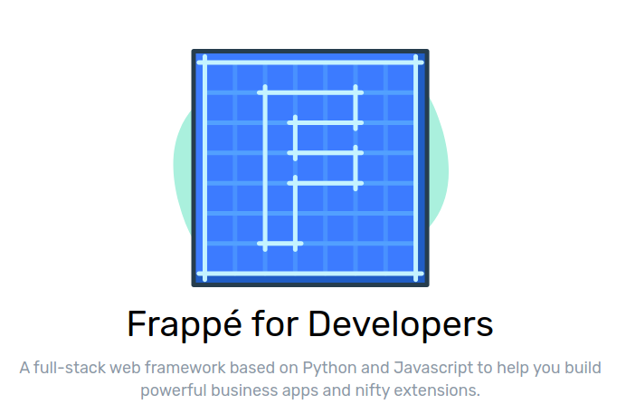

Frappe

Full-stack web framework



---

Frappe - basis for [ERPNext](https://erpnext.com)

Open source cloud ERP

Have optional payed plans

---


[Github organization](https://github.com/frappe)

* **> 1,000** opened issues
* ~20,000 commits in ERPNext
* ~15,000 commits in frappe
* ~170 commiters (~1500 in Django)

---

[Frappe team](https://frappe.io/about)


---

#### Full-stack web framework

* [**Python 2.7**](https://github.com/frappe/frappe/issues/2598)
* MariaDB / MySQL **only**
* integrated `node`, `less`, `bootstrap`

---

#### Huge SA3P

* emails
* dynamic settings
* caching (in `redis`)
* global search (custom solution)
* background and periodic tasks (`python-rq`)
* import/export any entity

---

#### Huge SA3P

* comments, likes, tags
* permissions (role and row-based)
* multitenancy
* docs managing
* PDF generation

---

#### Huge SA3P

* site chat
* google, facebook, github oAuth
* stripe integration
* Errors logging
* DB backups
* etc.

---

#### Installation

**It's a pain**

```
FROM ubuntu:16.04
MAINTAINER Vishal Seshagiri

USER root
RUN apt-get update
RUN apt-get install -y iputils-ping
RUN apt-get install -y git build-essential python-setuptools \
	python-dev libffi-dev libssl-dev redis-tools \
	software-properties-common libxrender1 libxext6 xfonts-75dpi \
	xfonts-base libjpeg8-dev zlib1g-dev libfreetype6-dev liblcms2-dev \
	libwebp-dev python-tk  apt-transport-https libsasl2-dev libldap2-dev \
	libtiff5-dev tcl8.6-dev tk8.6-dev wget
RUN wget https://bootstrap.pypa.io/get-pip.py && python get-pip.py
RUN pip install --upgrade setuptools pip
RUN useradd -ms /bin/bash frappe
RUN apt-get install -y curl
RUN apt-get install -y rlwrap
RUN apt-get install redis-tools
RUN apt-get install -y nano


#nodejs
RUN apt-get install curl
RUN curl https://deb.nodesource.com/node_6.x/pool/main/n/nodejs/nodejs_6.7.0-1nodesource1~xenial1_amd64.deb > node.deb \
 && dpkg -i node.deb \
 && rm node.deb
RUN apt-get install -y wkhtmltopdf
....
```
---

#### Backend

* Python 2.7
* MySQL
* tabs
* not consistent formatting
* [**lack of docs**](https://frappe.io/docs/current/api/model/frappe.model.document)
* lack of `__str__` and `__repr__`


```
In [2]: frappe.get_meta('User').fields
Out[2]: 
[<frappe.core.doctype.docfield.docfield.DocField at 0x7f87917bc2d0>,
 <frappe.core.doctype.docfield.docfield.DocField at 0x7f87917bc310>,
 ....
]
```

---

#### `bench` - giant `fabfile`
```
|-----------------------|-----------------------|-----------------------|-----------------------|
| backup                | backup-all-sites      | config                | disable-production    |
| backup-all-sites      | config                | disable-production    | download-translations |
| config                | disable-production    | download-translations | get-app               |
| disable-production    | download-translations | get-app               | init                  |
| download-translations | get-app               | init                  | install               |
| get-app               | init                  | install               | new-app               |
| init                  | install               | new-app               | new-site              |
| install               | new-app               | new-site              | prepare-staging       |
| new-app               | new-site              | prepare-staging       | release               |
| new-site              | prepare-staging       | release               | remote-reset-url      |
| prepare-staging       | release               | remote-reset-url      | remote-set-url        |
| release               | remote-reset-url      | remote-set-url        | remote-urls           |
| remote-reset-url      | remote-set-url        | remote-urls           | remove-app            |
| remote-set-url        | remote-urls           | remove-app            | renew-lets-encrypt    |
| remote-urls           | remove-app            | renew-lets-encrypt    | restart               |
| remove-app            | renew-lets-encrypt    | restart               | retry-upgrade         |
| renew-lets-encrypt    | restart               | retry-upgrade         | set-default-site      |
| restart               | retry-upgrade         | set-default-site      | set-mariadb-host      |
| retry-upgrade         | set-default-site      | set-mariadb-host      | set-nginx-port        |
| set-default-site      | set-mariadb-host      | set-nginx-port        | set-ssl-certificate   |
| set-mariadb-host      | set-nginx-port        | set-ssl-certificate   | set-ssl-key           |
| set-nginx-port        | set-ssl-certificate   | set-ssl-key           | set-url-root          |
| set-ssl-certificate   | set-ssl-key           | set-url-root          | setup                 |
| set-ssl-key           | set-url-root          | setup                 | shell                 |
| set-url-root          | setup                 | shell                 | src                   |
| setup                 | shell                 | src                   | start                 |
| shell                 | src                   | start                 | switch-to-branch      |
| src                   | start                 | switch-to-branch      | switch-to-develop     |
| start                 | switch-to-branch      | switch-to-develop     | switch-to-master      |
| switch-to-branch      | switch-to-develop     | switch-to-master      | update                |
| switch-to-develop     | switch-to-master      | update                | add-to-email-queue    |
| switch-to-master      | update                | add-to-email-queue    | build                 |
| update                | add-to-email-queue    | build                 | build-docs            |
| add-to-email-queue    | build                 | build-docs            | build-message-files   |
| build                 | build-docs            | build-message-files   | bulk-rename           |
| build-docs            | build-message-files   | bulk-rename           | clear-cache           |
| build-message-files   | bulk-rename           | clear-cache           | clear-limits          |
| bulk-rename           | clear-cache           | clear-limits          | clear-website-cache   |
| clear-cache           | clear-limits          | clear-website-cache   | console               |
| clear-limits          | clear-website-cache   | console               | destroy-all-sessions  |
| clear-website-cache   | console               | destroy-all-sessions  | disable-scheduler     |
| console               | destroy-all-sessions  | disable-scheduler     | disable-user          |
| destroy-all-sessions  | disable-scheduler     | disable-user          | doctor                |
| disable-scheduler     | disable-user          | doctor                | drop-site             |
| disable-user          | doctor                | drop-site             | enable-scheduler      |
| doctor                | drop-site             | enable-scheduler      | execute               |
| drop-site             | enable-scheduler      | execute               | export-csv            |
| enable-scheduler      | execute               | export-csv            | export-doc            |
| execute               | export-csv            | export-doc            | export-fixtures       |
| export-csv            | export-doc            | export-fixtures       | export-json           |
| export-doc            | export-fixtures       | export-json           | get-untranslated      |
| export-fixtures       | export-json           | get-untranslated      | import-csv            |
| export-json           | get-untranslated      | import-csv            | import-doc            |
| get-untranslated      | import-csv            | import-doc            | import-translations   |
| import-csv            | import-doc            | import-translations   | install-app           |
| import-doc            | import-translations   | install-app           | list-apps             |
| import-translations   | install-app           | list-apps             | make-app              |
```
---

#### ORM

* Custom
* Use **mouse** to create tables and columns
* Document description stored in `.json`
* Model fields also contain buttons, line breaks

```
{
 "allow_copy": 0, 
 "allow_guest_to_view": 0, 
 "allow_import": 0, 
 "allow_rename": 0, 
 "autoname": "hash", 
 "beta": 0, 
 "creation": "2012-07-03 13:30:35", 
 "custom": 0, 
 "docstatus": 0, 
 "doctype": "DocType", 
 "document_type": "Setup", 
 "editable_grid": 0, 
 "engine": "InnoDB", 
 "fields": [
  {
   "allow_bulk_edit": 0, 
   "allow_on_submit": 0, 
   "bold": 0, 
   "collapsible": 0, 
   "columns": 0, 
   "fieldname": "description_and_status", 
   "fieldtype": "Section Break", 
   "hidden": 0, 
   "ignore_user_permissions": 0, 
   "ignore_xss_filter": 0, 
   "in_filter": 0, 
   "in_global_search": 0, 
   "in_list_view": 0, 
   "in_standard_filter": 0, 
   "label": "", 
   "length": 0, 
   "no_copy": 0, 
   "permlevel": 0, 
   "print_hide": 0, 
   "print_hide_if_no_value": 0, 
   "read_only": 0, 
   "remember_last_selected_value": 0, 
   "report_hide": 0, 
   "reqd": 0, 
   "search_index": 0, 
   "set_only_once": 0, 
   "unique": 0
  }, 
  {
   "allow_bulk_edit": 0, 
   "allow_on_submit": 0, 
   "bold": 0, 
   "collapsible": 0, 
   "columns": 0, 
   "default": "Open", 
   "fieldname": "status", 
   "fieldtype": "Select", 
   "hidden": 0, 
   "ignore_user_permissions": 0, 
   "ignore_xss_filter": 0, 
   "in_filter": 0, 
   "in_global_search": 1, 
   "in_list_view": 1, 
   "in_standard_filter": 1, 
   "label": "Status", 
   "length": 0, 
   "no_copy": 0, 
   "options": "Open\nClosed", 
   "permlevel": 0, 
   "print_hide": 0, 
   "print_hide_if_no_value": 0, 
   "read_only": 0, 
   "remember_last_selected_value": 0, 
   "report_hide": 0, 
   "reqd": 0, 
   "search_index": 0, 
   "set_only_once": 0, 
   "unique": 0
  }
  ]
}

```

---

#### ORM

* soft-delete
* Allow perform simplest queries
* A lot of raw SQL in core

```
frappe.get_all(
	"ToDo",
	fields=["name", "modified"],
	filters = [["modified", ">", "2014-01-01"]]
)
```
---

#### ORM

Auto-generated skeleton for every model

```
question
├── __init__.py
├── question.js
├── question.json
├── question.py
├── test_question.js
└── test_question.py
```
---

#### ORM

Fat models

```
class Item(WebsiteGenerator):
	website = frappe._dict(
		page_title_field = "item_name",
		condition_field = "show_in_website",
		template = "templates/generators/item.html",
		no_cache = 1
	)
	def get_context(self, context):
		# Context used on Item page rendering
		context.show_search=True
		context.search_link = '/product_search'

		context.parents = get_parent_item_groups(self.item_group)

	def validate(self):
		super(Item, self).validate()

		if not self.item_name:
			self.item_name = self.item_code

		if not self.description:
			self.description = self.item_name

		self.validate_uom()

```
---

#### ORM

HTTP request available everywhere

```
`before_insert`
`validate` (before inserting or updating)
`on_update` (after saving)
`on_submit` (when document is set as submitted)
`on_cancel`
`on_trash` (before it is about to be deleted)
```
---

#### ORM

* Strange issues with `DocType` deletion
* Not uses DB constraints
* M2M with some kind of `Generic Foreign Key`
* A lot of DB queries for list view

---

#### Tests

`unittest`. Only.

All tests run against current DB

---

#### Views

* Every entity has list and detail view

* Templates customization using `Jinja`

* Static pages

---

#### Backend-Frontend

* RPC
* REST API

```
@frappe.whitelist()
def get_all_roles():
    // business logic
    return value
```

```
frappe.call({
	//dotted path to server method
    method: "frappe.core.doctype.user.user.get_all_roles",
    callback: function(r) {
        // code snippet
    }
})
```
---

### Misc

* [13 apps](https://erpnext.org/apps) for ERPNext
* [38 questions](https://stackoverflow.com/questions/tagged/erpnext+or+frappe) on stackoverflow
* Bugs in tutorial
* Broken image uploader (local)
* [https://demo.erpnext.com](https://demo.erpnext.com)
