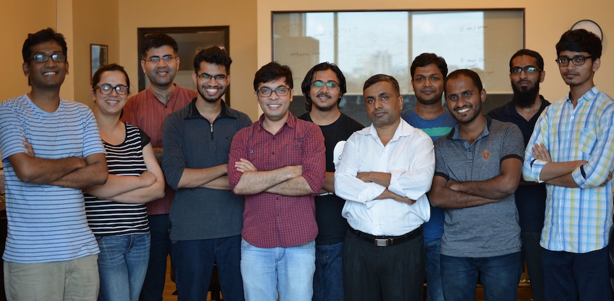

Frappe

Full-stack web framework


---

Frappe - basis for [ERPNext](https://erpnext.com)

Open source cloud ERP

Have optional payed plans

---


[Github organization](https://github.com/frappe)

* **> 1,000** opened issues
* ~20,000 commits in ERPNext
* ~15,000 commits in frappe
* ~170 commiters (~1500 in Django)

---

[Frappe team](https://frappe.io/about)



---

#### Full-stack web framework

* [**Python 2.7**](https://github.com/frappe/frappe/issues/2598)
* MariaDB / MySQL **only**
* integrated `node`, `less`, `bootstrap`

---

#### Huge SA3P

* emails
* dynamic settings
* caching (in `redis`)
* global search (custom solution)
* background and periodic tasks (`python-rq`)
* import/export any entity

---

#### Huge SA3P

* comments, likes, tags
* permissions (role and row-based)
* multitenancy
* docs managing
* PDF generation

---

#### Huge SA3P

* site chat
* google, facebook, github oAuth
* stripe integration
* Errors logging
* DB backups
* etc.

---

#### Installation

**It's a pain**

```
FROM ubuntu:16.04
MAINTAINER Vishal Seshagiri

USER root
RUN apt-get update
RUN apt-get install -y iputils-ping
RUN apt-get install -y git build-essential python-setuptools \
  python-dev libffi-dev libssl-dev redis-tools \
  software-properties-common libxrender1 libxext6 xfonts-75dpi \
  xfonts-base libjpeg8-dev zlib1g-dev libfreetype6-dev liblcms2-dev \
  libwebp-dev python-tk  apt-transport-https libsasl2-dev libldap2-dev \
  libtiff5-dev tcl8.6-dev tk8.6-dev wget
RUN wget https://bootstrap.pypa.io/get-pip.py && python get-pip.py
RUN pip install --upgrade setuptools pip
RUN useradd -ms /bin/bash frappe
RUN apt-get install -y curl
RUN apt-get install -y rlwrap
RUN apt-get install redis-tools
RUN apt-get install -y nano


#nodejs
RUN apt-get install curl
RUN curl https://deb.nodesource.com/node_6.x/pool/main/n/nodejs/nodejs_6.7.0-1nodesource1~xenial1_amd64.deb > node.deb \
 && dpkg -i node.deb \
 && rm node.deb
RUN apt-get install -y wkhtmltopdf
....
```
---

#### Backend

* Python 2.7
* MySQL
* tabs
* not consistent formatting
* [**lack of docs**](https://frappe.io/docs/current/api/model/frappe.model.document)
* lack of `__str__` and `__repr__`


```
In [2]: frappe.get_meta('User').fields
Out[2]: 
[<frappe.core.doctype.docfield.docfield.DocField at 0x7f87917bc2d0>,
 <frappe.core.doctype.docfield.docfield.DocField at 0x7f87917bc310>,
 ....
]
```

---

#### `bench` - giant `fabfile`
```
| purge-jobs                 | serve                    |
| new-language               | export-doc               |
| make-demo                  | execute                  |
| remove-from-installed-apps | set-default-site         |
| clear-limits               | config                   |
| download-translations      | get-untranslated         |
| get-app                    | renew-lets-encrypt       |
| set-maintenance-mode       | reset-perms              |
| migrate                    | enable-scheduler         |
| backup                     | build-message-files      |
| src                        | export-fixtures          |
| import-csv                 | restart                  |
| set-ssl-key                | destroy-all-sessions     |
| set-config                 | reinstall                |
| remote-reset-url           | list-apps                |
| set-limits                 | run-setup-wizard-ui-test |
| setup-help                 | watch                    |
| prepare-staging            | doctor                   |
| start                      | remove-app               |
| switch-to-develop          | remote-urls              |
| import-translations        | scheduler                |
| disable-user               | bulk-rename              |
| shell                      | run-ui-tests             |
| setup                      | setup-global-help        |
| request                    | import-doc               |
| release                    | build-docs               |
| set-ssl-certificate        | make-app                 |
| update                     | disable-scheduler        |
| use                        | export-csv               |
| backup-all-sites           | add-to-email-queue       |
| reload-doctype             | install                  |
| rebuild-global-search      | mysql                    |
| restore                    | disable-production       |
| drop-site                  | switch-to-master         |
| remote-set-url             | update-translations      |
| ready-for-migration        | build                    |
| switch-to-branch           | uninstall-app            |
| set-mariadb-host           | install-app              |
| clear-cache                | set-admin-password       |
| set-last-active-for-user   | trigger-scheduler-event  |
| version                    | worker                   |
| new-site                   | new-app                  |
| init                       | show-pending-jobs        |
| reload-doc                 | clear-website-cache      |
| retry-upgrade              | publish-realtime         |
| set-nginx-port             | add-system-manager       |
| set-limit                  | console                  |
| run-tests                  | set-url-root             |
| export-json                | schedule                 |
```
---

#### ORM

* Custom
* Use **mouse** to create tables and columns
* Document description stored in `.json`
* Model fields also contain buttons, line breaks

```
{
 "allow_copy": 0, 
 "allow_guest_to_view": 0, 
 "allow_import": 0, 
 "allow_rename": 0, 
 "autoname": "hash", 
 "beta": 0, 
 "creation": "2012-07-03 13:30:35", 
 "custom": 0, 
 "docstatus": 0, 
 "doctype": "DocType", 
 "document_type": "Setup", 
 "editable_grid": 0, 
 "engine": "InnoDB", 
 "fields": [
  {
   "allow_bulk_edit": 0, 
   "allow_on_submit": 0, 
   "bold": 0, 
   "collapsible": 0, 
   "columns": 0, 
   "fieldname": "description_and_status", 
   "fieldtype": "Section Break", 
   "hidden": 0, 
   "ignore_user_permissions": 0, 
   "ignore_xss_filter": 0, 
   "in_filter": 0, 
   "in_global_search": 0, 
   "in_list_view": 0, 
   "in_standard_filter": 0, 
   "label": "", 
   "length": 0, 
   "no_copy": 0, 
   "permlevel": 0, 
   "print_hide": 0, 
   "print_hide_if_no_value": 0, 
   "read_only": 0, 
   "remember_last_selected_value": 0, 
   "report_hide": 0, 
   "reqd": 0, 
   "search_index": 0, 
   "set_only_once": 0, 
   "unique": 0
  }, 
  {
   "allow_bulk_edit": 0, 
   "allow_on_submit": 0, 
   "bold": 0, 
   "collapsible": 0, 
   "columns": 0, 
   "default": "Open", 
   "fieldname": "status", 
   "fieldtype": "Select", 
   "hidden": 0, 
   "ignore_user_permissions": 0, 
   "ignore_xss_filter": 0, 
   "in_filter": 0, 
   "in_global_search": 1, 
   "in_list_view": 1, 
   "in_standard_filter": 1, 
   "label": "Status", 
   "length": 0, 
   "no_copy": 0, 
   "options": "Open\nClosed", 
   "permlevel": 0, 
   "print_hide": 0, 
   "print_hide_if_no_value": 0, 
   "read_only": 0, 
   "remember_last_selected_value": 0, 
   "report_hide": 0, 
   "reqd": 0, 
   "search_index": 0, 
   "set_only_once": 0, 
   "unique": 0
  }
  ]
}

```

---

#### ORM

* Allow perform simplest queries
* A lot of raw SQL in core

```
# get list of objects as dicts
# [{'name': 'First ToDo', 'modified': "2014-01-02"}]
frappe.get_all(
  "ToDo",
  fields=["name", "modified"],
  filters = [["modified", ">", "2014-01-01"]]
)

# retrieve existing
todo = frappe.get_doc("ToDo", "ec7acf401e")

# create new one
todo = frappe.get_doc({"doctype": "ToDo", "text": "test"})
todo.insert()
frappe.db.commit()
```
---

#### ORM

Auto-generated skeleton for every model

```
question
├── __init__.py
├── question.js
├── question.json
├── question.py
├── test_question.js
└── test_question.py
```
---

#### ORM

Fat models

```
class Item(WebsiteGenerator):
  website = frappe._dict(
    page_title_field = "item_name",
    condition_field = "show_in_website",
    template = "templates/generators/item.html",
    no_cache = 1
  )
  def get_context(self, context):
    # Context used on Item page rendering
    context.show_search=True
    context.search_link = '/product_search'

    context.parents = get_parent_item_groups(self.item_group)

  def validate(self):
    super(Item, self).validate()

    if not self.item_name:
      self.item_name = self.item_code

    if not self.description:
      self.description = self.item_name

    self.validate_uom()

```
---

#### ORM

HTTP request available everywhere

```
`before_insert`
`validate` (before inserting or updating)
`on_update` (after saving)
`on_submit` (when document is set as submitted)
`on_cancel`
`on_trash` (before it is about to be deleted)
```
---

#### ORM

* Strange issues with `DocType` deletion
* Not uses DB constraints
* M2M with some kind of `Generic Foreign Key`
* A lot of DB queries for list view

---

#### Tests

`unittest`. Only.

All tests run against current DB

---

#### Views

* Every entity has list and detail view

* Templates customization using `Jinja`

* Static pages

---

#### Backend-Frontend

* RPC
* [REST API](https://frappe.io/docs/user/en/guides/integration/rest_api)

```
@frappe.whitelist()
def get_all_roles():
    // business logic
    return value
```

```
frappe.call({
  //dotted path to server method
  method: "frappe.core.doctype.user.user.get_all_roles",
  callback: function(r) {
      // code snippet
  }
})
```
---

### Misc

* [13 apps](https://erpnext.org/apps) for ERPNext
* [38 questions](https://stackoverflow.com/questions/tagged/erpnext+or+frappe) on stackoverflow
* Bugs in tutorial
* Broken image uploader (local)
* [https://demo.erpnext.com](https://demo.erpnext.com)
---

### Conclusion

* Huge framework
* Nice looking
* Lack of docs and community
